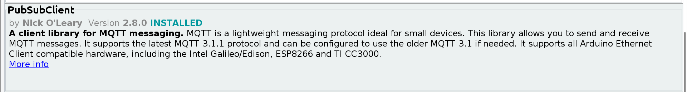

# Setup Mosquitto MQTT Broker on Ubuntu 20.04 to communicate with Mosquitto Client ESP32

I wrote this MQTT tutorial to help me out in the future, but hopefully it will help someone else along the way. 

# 1. Introduction

MQTT is an important IoT (Internet of Things) protocol. MQTT has a Pub/Sub model operating mechanism, consisting of 2 main components: MQTT client (Publisher/Subscriber) and MQTT Broker (broker server). 

There are several types MQTT Broker which are written in various programming language. In this tutorial, I will introduce to you a fairly popular MQTT broker Mosquitto, as well as how to install it on Ubuntu.

# 2. MQTT Broker Mosquitto

Mosquitto is an open source MQTT Broker allows devices to transmit data in version 5.0, 3.1.1 and 3.1 of MQTT protocol. They are swift, lightweight following publish/subscribe model that is used commonly in the Internet of Things field.

## Advantages

 - The outstanding advantages of Mosquitto are fast data transmission and processing speed, high stability, widely used and suitable for embedded applications.

- Mosquitto is very light and suitable for use on all devices.

- In addition, Mosquitto also supports TLS/SSL protocols (protocols for server and client authentication, encryption of messages to secure data).

## Disadvantages

- Some disadvantages of mosquitto are that it is difficult to design when making large applications and there are few device authentication methods, so the security is still not optimal.

# 3. Setup Mosquitto Broker on Ubuntu 20.04

To install an MQTT server using Mosquiito broker with Ubuntu, we will first need an Ubuntu server with `root` access and a `TCP:1883` port open on the firewall.

## 3.1 Install Mosquitto Broker

Open a ternimal and run commands:

    sudo apt-get update
    sudo apt-get install mosquitto

To get accquainted with Mosquitto service, we run the following command:

    service mosquitto

Output:

     * Usage: /etc/init.d/mosquitto {start|stop|reload|force-reload|restart|try-restart|status}

The output shows all the actions we can do with Mosquitto Broker. They are **`start`**, **`stop`**, **`reload`**, **`force-reload`**, **`restart`**, **`try-restart`**, **`status`**. 

**To check status of Mosquitto Broker**, we run command:

    service mosquitto status

Output:

    ● mosquitto.service - Mosquitto MQTT v3.1/v3.1.1 Broker
        Loaded: loaded (/lib/systemd/system/mosquitto.service; enabled; vendor pre>
        Active: active (running) since Sat 2021-11-06 13:31:50 +07; 16min ago
        Docs: man:mosquitto.conf(5)
                man:mosquitto(8)
    Main PID: 1478 (mosquitto)
        Tasks: 3 (limit: 9313)
        Memory: 2.0M
        CGroup: /system.slice/mosquitto.service
                └─1478 /usr/sbin/mosquitto -c /etc/mosquitto/mosquitto.conf

Service Mosquitto will be started immediately after installation and messages are sent via port 1883 (default port of Mosquitto MQTT Broker and some other MQTT Broker).

**To check the status of port 1883**, we run command:

    netstat -plntu | grep 1883

Output:

    (Not all processes could be identified, non-owned process info
    will not be shown, you would have to be root to see it all.)
    tcp        0      0 0.0.0.0:1883            0.0.0.0:*               LISTEN      -                   
    tcp6       0      0 :::1883                 :::*                    LISTEN      -                   

## 3.2 Install Mosquitto client and test Mosquitto broker

To install Mosquitto client, we run command:

    sudo apt-get install mosquitto-clients

We will perform the Publish and Subscribe test to the newly installed Mosquitto Broker. We will use 2 terminal windows, one to publish messages to the broker, the other to perform subclribe messages from the broker.

**A **`topic`** is used by the broker as labels to filter messages for each client connected to the broker. A client that subscribes to a **`topic`** will only receive messages published by other clients on that **`topic`**.**

Open a new terminal, run command:

    mosquitto_sub -t "test"

This command will create a Mosquitto client that subscribe to the "test" topic to receive all the messages of that topic.

Option `-t` will be followed by a `topic name`. We will go to detail of all options later on.

Open a new terminal and run command:

    mosquitto_pub -m "Hello world!" -t "test"

Option `-m` will be followed by a `message`.

Run other commands:

    mosquitto_pub -m "message from mosquitto_pub client" -t "test"
    mosquitto_pub -m "Hihi" -t "test"

So far, we have completed installation and testing on localhost MQTT broker Mossquitto.

## 3.3 Understanding Mosquitto client options

### 3.3.1 mosquitto_pub

To see all the usage of mosquitto_pub, run command:

    mosquitto_pub --help

**Syntax:** mosquitto_pub **`{[-h host] [-p port] [-u username] [-P password] -t topic | -L URL}`** **`{-f file | -l | -n | -m message}`** `[-c]` `[-k keepalive]` `[-q qos]` `[-r]` `[--repeat N]` `[--repeat-delay time]` `[-A bind_address]` `[-i id]` `[-I id_prefix]` `[-d]` `[--quiet]` `[-M max_inflight]` `[-u username [-P password]]` `[--will-topic [--will-payload payload] [--will-qos qos] [--will-retain]]` `[{--cafile file | --capath dir} [--cert file] [--key file] [--ciphers ciphers] [--insecure] [--tls-alpn protocol]  [--tls-engine engine] [--keyform keyform] [--tls-engine-kpass-sha1]]` `[--psk hex-key --psk-identity identity [--ciphers ciphers]]` `[--proxy socks-url]` `[--property command identifier value]` `[-D command identifier value]`

Note: 

- Options enclosed in **curly brackets** are **required**.

- Options enclosed in **square brackets** are **not required**.

#### Explanation

| Option      | Description |
| :-: | ----------- |
| **-A**      | bind the outgoing socket to this host/ip address. Use to control which interface       the client communicates over. |
| **-d**   | enable debug messages. |
| **-D**   | Define MQTT v5 properties. See the documentation for more details. |
| **-f**   | send the contents of a file as the message. |
| **-h**   | mqtt host to connect to. Defaults to localhost.        |
| **-i**   | id to use for this client. Defaults to mosquitto_pub_appended with the process id. |
| **-I**   | define the client id as id_prefix appended with the process id. Useful for when the broker is using the clientid_prefixes option. |
| **-k**   | keep alive in seconds for this client. Defaults to 60. |
| **-L**   | specify user, password, hostname, port and topic as a URL in the form: mqtt(s)://[username[:password]@]host[:port]/topic |
| **-l**   | read messages from stdin, sending a separate message for each line. |
| **-m**   | message payload to send. |
| **-M**   | the maximum inflight messages for QoS 1/2.. |
| **-n**   | send a null (zero length) message. |
| **-p**   | network port to connect to. Defaults to 1883 for plain MQTT and 8883 for MQTT over TLS. |
| **-P**   | provide a password        |
| **-q**   | quality of service level to use for all messages. Defaults to 0. |
| **-r**   | message should be retained. |
| **-s**   | read message from stdin, sending the entire input as a message. |
| **-t**   | mqtt topic to publish to. |
| **-u**   | provide a username |
| **-V**   | specify the version of the MQTT protocol to use when connecting. Can be mqttv5, mqttv311 or mqttv31. Defaults to mqttv311. |

For other command options, you can use command `mosquitto_pub --help`.

## 3.4 Setting up Authentication in Mosquitto MQTT Broker

If you have just installed the Mosquitto broker or it is working, make sure it is stopped (to be in the safe side).

Run this command to stop Mosquitto service:

    service mosqutto stop

### 3.4.1 Creating a new authenticated profile

Password file will contain your username and the encrypted password. Run the following command to create and add a user to this file.

    sudo mosquitto_passwd -c /etc/mosquitto/passwd <user_name>

Then, you will be asked for your password twice, enter that too.

### 3.4.2 Activate authenticating action of MQTT

Now we have to give the location of the password file to the Mosquitto broker config file. To do that open the mosquitto.conf file using the following command,

Run the following command:

    sudo gedit /etc/mosquitto/mosquitto.conf

And add following two entries to the mosquitto.conf file:

    password_file /etc/mosquitto/passwd
    allow_anonymous false

**“allow_anonymous false” is used to prevent, clients without username and password to connecting to the broker.**

Now, you need to start the Mosquitto MQTT service. Run:

    service mosquitto start

### 3.4.3 Run a test with Authentication

Open new terminal and run:

    mosquitto_sub -t "test_topic" -u <user_name> -P <password>

Open another terminal and run:

    mosquitto_pub -l -t "test_topic" -u <user_name> -P <password>

On the other hand, you open a new termial and try to creat a client with incorrect credential. In my case, there does not exist username "test_user" and password "test_pass". When I run command `mosquitto_sub -t "test_topic" -u test_user -P test_pass` then the output will be `Connection error: Connection Refused: not authorised.`

### 3.4.4 Check the list of existing authenticated profiles

To check existing authenticated profiles, run command:

    sudo gedit /etc/mosquitto/passwd

In text file, you will get a list of existing authenticated profiles in syntax

    <user_name>:<encoded_password>

### 3.4.5 Delete authenticated profiles

In case you want to delete an authenticated profile, you can run the following command:

    sudo mosquitto_passwd -D /etc/mosquitto/passwd <existed_user_name>

### 3.4.6 Unactivate authenticating action of MQTT

Run command:

    sudo gedit /etc/mosquitto/mosquitto.conf

Comment the following entries in that text file:

    password_file /etc/mosquitto/passwd
    allow_anonymous false

# 4. Configure ESP32 for MQTT transmission

At first, you need to add Library "PubSubClient.h" of Nick O'Leary.

Completed source code for configuring MQTT transmission with ESP32.

    #include <WiFi.h>
    #include <PubSubClient.h>

    // Replace the next variables with your SSID/Password combination
    const char* ssid = "your_wifi_ssid";
    const char* password = "your_wifi_password";

    // Add your MQTT Broker IP address, example:
    // const char* mqtt_server = "192.168.1.144";
    const char* mqtt_server = "your_mqtt_server_ip_address";

    WiFiClient espClient;
    PubSubClient client(espClient);

    long lastMsg = 0;
    int value = 0;

    void setup_wifi() {
        delay(10);
        // We start by connecting to a WiFi network
        Serial.println();
        Serial.print("Connecting to ");
        Serial.println(ssid);

        WiFi.begin(ssid, password);

        while (WiFi.status() != WL_CONNECTED) {
            delay(500);
            Serial.print(".");
        }

        Serial.println("");
        Serial.println("WiFi connected");
        Serial.println("IP address: ");
        Serial.println(WiFi.localIP());
    }

    void callback(char* topic, byte* message, unsigned int length) {
        Serial.print("Message arrived on topic: ");
        Serial.print(topic);
        Serial.print(". Message: ");
        String messageTemp;

        for (int i = 0; i < length; i++) {
            Serial.print((char)message[i]);
            messageTemp += (char)message[i];
        }
        Serial.println();

        // Feel free to add more if statements to control more GPIOs with MQTT

        // If a message is received on the topic esp32/output, you check if the message is either "on" or "off".
        // Changes the output state according to the message
        if (String(topic) == "esp32/output") {
            Serial.print("Changing output to ");
            if (messageTemp == "on") {
            Serial.println("on");
            }
            else if (messageTemp == "off") {
            Serial.println("off");
            }
        }
    }

    void reconnect() {
        // Loop until we're reconnected
        while (!client.connected()) {
            Serial.print("Attempting MQTT connection...");
            // Attempt to connect
            if (client.connect("ESP32_Client", "your_broker_user_name", "your_broker_password")) {
            Serial.println("connected");
            // Subscribe
            client.subscribe("esp32_sub");
            } else {
            Serial.print("failed, rc=");
            Serial.print(client.state());
            Serial.println(" try again in 5 seconds");
            // Wait 5 seconds before retrying
            delay(5000);
            }
        }
    }

    void setup() {
        Serial.begin(115200);
        setup_wifi();
        // Default port is 1883
        client.setServer(mqtt_server, <port>);
        client.setCallback(callback);
    }

    void loop() {
        if (!client.connected()) {
            reconnect();
        }
        client.loop();

        long now = millis();
        if (now - lastMsg > 1000) {
            lastMsg = now;

            String text = "i am esp32, " + String(value);
            char buf[50] = "";
            text.toCharArray(buf, 50);
            client.publish("esp32_pub", buf);
            value++;
        }
    }

In this source code, there are some parameters you need to modify such as:
"your_wifi_ssid", "your_wifi_password", 
"your_broker_user_name", "your_broker_password" and `<port>`

To create a Mosquitto subscriber to listen to ESP32, open a new terminal and run command:

    mosquitto_sub -t "esp32_pub" -u <your_broker_user_name> -P <your_broker_password>

To create a Mosquitto publisher to send data to ESP32, open a new terminal and run command:

    mosquitto_pub -l -t "esp32_sub" -u <your_broker_user_name> -P <your_broker_password>

Then each line you type, you will send a message to ESP32.

Other way to send a message to ESP32, open a new terminal and run:

    mosquitto_pub -m "the message you want to send" -t "esp32_sub" -u <your_broker_user_name> -P <your_broker_password>

